# 🌍 Revatix

**Global Remittance Infrastructure for VAT Refunds & Payroll**  
Wallet-native. AI-powered. Borderless. Built on Yellow Network with Nitrolite.

[](https://opensource.org/licenses/MIT)
[](https://yellow.org/)
[](https://github.com/erc7824/nitrolite)

---

## 🚀 Overview

**Revatix** is the **first gasless VAT Refund & Payroll Payment Infrastructure** that operates with Yellow Network's state channel technology.  
It leverages:
- **Yellow Network's gasless state channel protocol** with Nitrolite SDK
- **Wallet-based authentication** for seamless user experience
- **AI orchestration** for payroll computation and VAT eligibility
- **Supabase** for persistence, audit trails, and compliance exports

Two killer use cases, unified under one infrastructure:
1. **VAT Refunds** – Tourists scan QR at departure → confirm in wallet → refund instantly via gasless state channels.
2. **Payroll Automation** – Employers upload CSV → AI computes net salaries + FX → HR scans one QR → employees are paid instantly through gasless state channels.

---

## 🛑 Problem

- **Tourist VAT Refunds** are slow, manual, and often unclaimed due to airport delays.
- **Global Payroll** is plagued by high fees, delayed wires, hidden FX costs, and compliance overhead.
- Both processes rely on **centralized, fragmented rails** that fail in a borderless world.

---

## ✅ Solution

**Revatix** provides a **gasless remittance infrastructure** where:
- Tourists **receive VAT refunds** instantly in stablecoins via gasless state channels.
- Employers **disburse payroll globally** with a single scan - **zero gas fees**.
- Yellow Network ensures **instant finality** and **completely gasless transactions** through state channel technology.

---

## ⚙️ How It Works

### VAT Refund Flow
1. Retailer issues invoice + VAT claim tag.
2. Tourist opens Revatix, uploads the invoice, flight ticket and VAT claim tag QR at any time, anywhere within 90 days.
3. AI validates eligibility with the Operator system.
4. Tourist confirms transfer in **wallet**.
5. Refund delivered instantly via **gasless state channels** - **zero fees**.

### Payroll Flow
1. Employer uploads payroll CSV.
2. AI parses salaries, taxes, FX → generates payment plan.
3. Dashboard displays preview → CFO/HR scans one QR.
4. Treasury wallet creates **gasless state channels** for bulk payments.
5. Employees receive stablecoin salaries instantly through **gasless state channels** - **zero fees**.

---

## 🔮 Features

### ✅ **Implemented Features**
- **Wallet-Based Authentication**: Connect wallet = Login, Disconnect wallet = Logout
- **Yellow Network Integration**: Full Nitrolite SDK integration with ERC-7824 state channels
- **State Channel Management**: Create, update, close, and challenge state channels
- **Gasless Transactions**: Zero-fee transactions through Yellow Network's state channels
- **Testnet Support**: Complete testnet setup with Yellow Network faucet integration
- **Nitrolite Examples**: All workshop examples implemented (Basic, Payment, Challenge, Batch, Cross-chain, Gasless)
- **Cerebro Game**: Advanced multi-participant state channel game implementation
- **Responsive UI**: Modern React interface with Framer Motion animations

### 🚧 **Core Features (In Development)**
- **Wallet-Native UX**: No heavy contracts, no clunky DApps → just wallet scan + confirm.
- **Tourism-Grade Simplicity**: Refunds in 2 steps → Scan QR → Confirm transfer.
- **Enterprise Payroll**: AI-driven salary parsing, FX conversion, and bulk payouts via state channels.
- **Transparency**: State channel updates embed `claim_id` and `payrun_id` for deterministic audits.
- **Compliance Ready**: Supabase logs + JSON/CSV exports for regulators and finance teams.
- **Scalability**: State channels enable thousands of instant transactions with minimal fees.

---

## ⚡High-Level System Architecture


## ✅ VAT Refund – Airport Flow


## ✅ Payroll – CSV to Batched Payouts

```mermaid
sequenceDiagram
  participant HR as Employer (HR/CFO)
  participant Dash as Employer Dashboard
  participant API as Revatix API
  participant AI as AI Orchestrator
  participant FX as FX Oracle
  participant Supa as Supabase
  participant Wallet as EVM Wallet (Treasury)
  participant YN as Yellow Network
  participant Nitro as Nitrolite SDK
  participant Emp as Employees (Wallets)

  HR->>Dash: Upload CSV / Contracts
  Dash->>API: Create payrun (payload)
  API->>AI: Parse salaries, taxes, net pay
  AI->>FX: Snapshot FX (STT)
  FX-->>AI: Rates
  AI-->>API: TxPlan[] (chunked ≤16 per group)
  API->>Supa: Save payrun + tx sets
  API-->>Dash: Preview totals, fees, FX

  HR->>Wallet: Scan master QR (authorize)
  loop For each batch
    Wallet->>YN: Create state channels (bulk payments)
    YN-->>Wallet: Channels created (instant)
    Wallet->>API: Callback (channel_ids, batch_id)
    API->>Nitro: Verify channel states
    Nitro-->>API: Confirmed
    API->>Supa: Mark batch complete
  end

  note over Emp: Employees receive payments instantly
  API-->>Dash: Payrun completed (channel_ids, exports)
```



## ✅ Shared Transfer Intent


## 🚀 Getting Started

### Prerequisites

- Node.js 18+ and npm/pnpm
- MetaMask or any EVM-compatible wallet
- Git

### Installation

1. **Clone the repository:**
```bash
git clone https://github.com/Vishal4742/revatix.git
cd revatix
```

2. **Install dependencies:**
```bash
npm install
# or
pnpm install
```

3. **Set up environment variables:**
```bash
cp .env.example .env.local
# Edit .env.local with your configuration
```

4. **Start the development server:**
```bash
npm run dev
# or
pnpm dev
```

5. **Open your browser:**
Navigate to `http://localhost:5173` (or the port shown in terminal)

### Environment Setup

Create a `.env.local` file with the following variables:

```env
# Yellow Network Configuration
VITE_YELLOW_NETWORK_CLEARNODE_URL=wss://clearnet.yellow.org/ws
VITE_YELLOW_NETWORK_DEFAULT_CHAIN=yellow-mainnet
VITE_YELLOW_NETWORK_FAUCET_URL=https://faucet.yellow.org/

# Supabase Configuration (Optional)
VITE_SUPABASE_URL=your_supabase_url
VITE_SUPABASE_ANON_KEY=your_supabase_anon_key

# Nitrolite Configuration (Optional)
VITE_NITROLITE_API_KEY=your_nitrolite_api_key
```

## 🧪 Testnet Testing

### Quick Testnet Setup

1. **Run the testnet setup script:**
```bash
npm run setup:testnet
```

2. **Configure your wallet for testnet:**
   - Add Yellow Network testnet to MetaMask
   - Get test YELLOW tokens from: https://faucet.yellow.org/

3. **Test the application:**
   - Connect your wallet
   - Use the State Channel Manager (Activity icon in Token Balance)
   - Test VAT refunds and payroll processing

### Testnet Resources

- **Yellow Network Faucet**: https://faucet.yellow.org/
- **Yellow Network Explorer**: https://explorer.yellow.org/
- **Testnet Setup Guide**: See `TESTNET_SETUP.md` for detailed instructions
- **Troubleshooting Guide**: See `YELLOW_NETWORK_TROUBLESHOOTING.md` for common issues and solutions

### Testing Checklist

- [ ] Wallet connection on testnet
- [ ] State channel creation
- [ ] Payment processing
- [ ] VAT refund workflow
- [ ] Payroll processing
- [ ] Error handling

---

## 🛠️ Tech Stack

- **Blockchain**: Yellow Network
  – Gasless state channels with instant finality, zero transaction fees, and multi-chain support.

- **Wallet**: EVM-Compatible Wallets
  – Mobile-first signing with QR scan/deep link support.

- **AI Layer**: [Bolt.new](https://bolt.new) + Gemini
  – Salary parsing, jurisdictional tax/FX reasoning, transfer instruction generation.

- **Backend**: [Supabase](https://supabase.com/)
  – Postgres DB, object storage, user audit logs, and compliance artifacts.

- **Frontend**: React + Vite + TypeScript
  – Modern React application with Framer Motion animations and responsive design.

- **State Channels**: Nitrolite SDK for gasless off-chain state management & instant zero-fee settlements.

- **Authentication**: Wallet-based authentication
  – Connect wallet = Login, Disconnect wallet = Logout for seamless DeFi experience.

## 📁 Project Structure

```
revatix/
├── src/
│   ├── components/          # React components
│   │   ├── StateChannelManager.tsx
│   │   ├── NitroliteExamplesManager.tsx
│   │   ├── CerebroGameManager.tsx
│   │   ├── YellowNetworkFaucet.tsx
│   │   └── ...
│   ├── hooks/              # Custom React hooks
│   │   ├── useAuth.ts
│   │   └── useWallet.ts
│   ├── utils/              # Utility functions
│   │   ├── yellowNetwork.ts
│   │   └── navigation.ts
│   ├── services/           # Service layers
│   │   └── yellowNetworkService.ts
│   ├── examples/           # Nitrolite examples
│   │   ├── nitrolite-examples.ts
│   │   └── cerebro-example.ts
│   └── config/             # Configuration
│       └── environment.ts
├── scripts/                # Setup scripts
│   └── setup-testnet.js
├── TESTNET_SETUP.md        # Testnet setup guide
├── ENVIRONMENT_SETUP.md    # Environment setup guide
├── CEREBRO_IMPLEMENTATION.md # Cerebro implementation docs
└── YELLOW_NETWORK_TROUBLESHOOTING.md # Troubleshooting guide
```

## 🚀 Available Scripts

```bash
# Development
npm run dev          # Start development server
npm run build        # Build for production
npm run preview      # Preview production build

# Testnet
npm run setup:testnet # Interactive testnet setup
npm run test:testnet  # Run testnet tests

# Linting & Formatting
npm run lint         # Run ESLint
npm run format       # Format code with Prettier
```

---

## 📡 Data Flow

1. **Input**
   - VAT Refunds: Retailer receipts, passport/KYC snapshots.
   - Payroll: Employer CSV with gross pay data.

2. **Processing**
   - AI parses salaries, deductions, taxes.
   - AI validate VAT eligibility & fetches FX rates.

3. **Persistence**
   - Supabase stores invoices, payruns, logs, validation proofs.

4. **Execution**
   - API creates state channels → generates QR codes → Wallet signs & submits.

5. **Finality**
   - Yellow Network executes state channel updates.
   - Nitrolite SDK confirms results.
   - Supabase logs for audit.

6. **Audit**
   - Export JSON/CSV/PDF reports for regulators & enterprise compliance.

---

## 🔐 Security & Compliance

- **Treasury Wallet**: Multisig or HSM-protected wallet for payroll disbursements.
- **Dual Approval**: CFO + HR authorization required for bulk payruns.
- **Oracle Verification**: Only signed operator callbacks can validate VAT claims.
- **KYC/AML Hooks**: Wallet screening APIs integrated during onboarding.
- **Immutable Audit Trail**: Supabase DB + state channel hashes provide verifiable record-keeping.
- **Circuit Breakers**: Abort payruns if totals exceed configured treasury limits.

---

## 💰 Business Model

- **Platform Fees**: 0.5% per payout (tourist refund / payroll).
- **Enterprise SaaS**: Subscription-based dashboards & compliance exports for HR/finance teams.
- **Partnership Revenue**: Integration fees with VAT Operators & HR SaaS providers.
- **Future Yield**: Earn yield on idle treasury balances + capture micro-spreads on FX conversions.

---

## 📈 Go-To-Market (GTM)

- **Phase 1 – Tourism**:
  Pilot deployment at **Dubai International Airport** with VAT operator integration.

- **Phase 2 – Payroll**:
  Target **DAOs, Web3 startups, and SMEs** in Africa & LATAM with state channel-based payroll rails on Yellow Network.

- **Phase 3 – Enterprise Expansion**:
  Partner with **multinationals** and expand VAT refunds to EU, UK, Singapore, and Saudi Arabia.

- **Phase 4 – DAO Governance**:
  Transition to community-driven governance of refund % rates, fee splits, and expansion markets.

---

## 🔮 Roadmap

### ✅ **Completed (v1.0)**
- ✅ **Wallet-Based Authentication**: Connect wallet = Login, Disconnect wallet = Logout
- ✅ **Yellow Network Integration**: Full Nitrolite SDK integration with ERC-7824 state channels
- ✅ **State Channel Management**: Create, update, close, and challenge state channels
- ✅ **Gasless Transactions**: Zero-fee transactions through Yellow Network's state channels
- ✅ **Testnet Support**: Complete testnet setup with Yellow Network faucet integration
- ✅ **Nitrolite Examples**: All workshop examples implemented
- ✅ **Cerebro Game**: Advanced multi-participant state channel game implementation

### 🔄 **In Progress (v1.1)**
- 🔄 **VAT Refund Flow**: Complete tourist VAT refund workflow
- 🔄 **Payroll Automation**: CSV-based payroll processing with AI
- 🔄 **QR Code Integration**: Wallet scan and deep link support
- 🔄 **Supabase Integration**: Database persistence and audit trails

### 🚧 **Planned (v1.2)**
- 🚧 **Multi-country VAT Support**: EU, UK, Singapore, Saudi Arabia
- 🚧 **AI-driven Tax Compliance**: Automated tax calculation and compliance
- 🚧 **Enterprise Integrations**: HR SaaS and VAT operator partnerships
- 🚧 **PDF-based Compliance Exports**: Regulatory reporting and audit trails

### 🌐 **Future (v2.0)**
- 🌐 **Revatix DAO**: Community-driven governance
- 🌐 **Protocol Governance**: Decentralized fee management and expansion decisions
- 🌐 **Cross-chain Support**: Multi-blockchain state channel interoperability

---

## 🌟 Why Yellow Network & State Channels?

Revatix leverages the unique advantages of Yellow Network and state channels:

- **Instant Finality**: Off-chain state channels enable real-time VAT refunds and instant payroll.
- **Minimal Transaction Fees**: State channels reduce costs by 90%+ compared to on-chain transactions.
- **Atomic Transfers**: State channel updates enable efficient bulk payroll disbursements.
- **Scalability**: State channels support thousands of transactions per second.
- **Developer-Friendly**: Nitrolite SDK simplifies integration with comprehensive state channel management.
- **Energy Efficiency**: Off-chain processing aligns with corporate ESG goals.
- **Multi-Chain Support**: Works across multiple EVM-compatible blockchains for maximum flexibility.

---

## 🤝 Contributing

We welcome contributions to Revatix! Here's how you can help:

### **Ways to Contribute**
- 🐛 **Report Bugs**: Open an issue with detailed bug reports
- 💡 **Feature Requests**: Suggest new features or improvements
- 🔧 **Code Contributions**: Submit pull requests for bug fixes or features
- 📚 **Documentation**: Improve documentation and add examples
- 🧪 **Testing**: Help test on different networks and wallets

### **Development Workflow**
1. Fork the repository
2. Create a feature branch: `git checkout -b feature/amazing-feature`
3. Make your changes and test thoroughly
4. Commit your changes: `git commit -m 'Add amazing feature'`
5. Push to the branch: `git push origin feature/amazing-feature`
6. Open a Pull Request

### **Code Standards**
- Follow TypeScript best practices
- Use ESLint and Prettier for code formatting
- Write meaningful commit messages
- Add tests for new features
- Update documentation as needed

---

## 📄 License

This project is licensed under the MIT License - see the [LICENSE](LICENSE) file for details.

---

## 🙏 Acknowledgments

- **Yellow Network** for providing gasless state channel infrastructure
- **Nitrolite SDK** for ERC-7824 state channel implementation
- **ERC-7824 Community** for the state channel protocol specification
- **Supabase** for backend infrastructure
- **React & Vite** communities for excellent development tools

---

## 📞 Support

- **Documentation**: Check our [docs](https://docs.revatix.com) (coming soon)
- **Issues**: Report bugs and request features on [GitHub Issues](https://github.com/Vishal4742/revatix/issues)
- **Discord**: Join our community on [Discord](https://discord.gg/revatix) (coming soon)
- **Twitter**: Follow us on [@RevatixApp](https://twitter.com/RevatixApp) (coming soon)

---

**Built with ❤️ by the Revatix Team**
